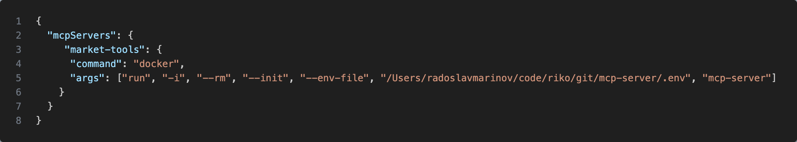

https://github.com/modelcontextprotocol/typescript-sdk


## Dockerization

  - Build docker image
    ```bash
    docker build -t mcp-server .
    ```

  - Run the image
    ```bash
    docker run -i --env-file '/Users/radoslavmarinov/code/riko/git/mcp-server/.env' mcp-server
    ```

## Integration with Claude

  - open Claude desktop
  - open Settings -> Developer -> Edit Config
  - add the following entry into the `mcpServers`

    ```json
      "market-tools": {
        "command": "docker",
        "args": ["run", "-i", "--rm", "--init", "--env-file", "<path_to_env_file>", "mcp-server"]
      }
    ```

    The configuration file should look similar to this:
     


[Coin Market Cap](https://coinmarketcap.com/api/documentation/v1/#)

## Examples
  - ### getLatestCryptoCurrency
    To utilize this tool, open Claude and enter:
    > Give me latest price of Ethereum

  - ### Accept requests to check the prices of specific crypto assets.
    Input:
    > What is the price of Ethereum?